## Azure End-to-End Data Engineering Pipeline: Data Modeling, Automation, and Reporting

## Project Description

This project implements a modern Azure-based data engineering and analytics pipeline to extract, process, and visualize music store sales data from the Chinook SQL database. The solution leverages Azure services and Power BI to deliver actionable business insights regarding revenue, track sales, artist performance, and genre popularity across countries.   

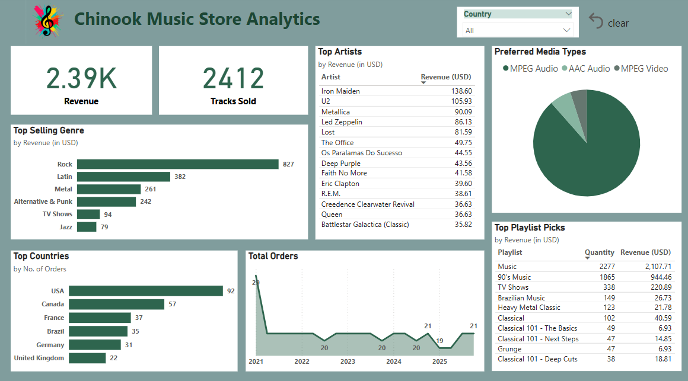

### Key Features
- End-to-end ETL pipeline using Azure-native services
- Clean, structured medallion architecture (Bronze, Silver, Gold)
- Dynamic Power BI dashboard with metrics like revenue, top artists, track sales, and preferred media types
- Secure and scalable infrastructure with automated daily refreshes
- Data model and relationships design

---
## Value to Business

This solution provides data-driven insights into digital music sales, helping stakeholders:
- Understand revenue breakdowns by artist, genre, and playlist
- Identify top-performing regions and customer behaviors
- Make informed business and marketing decisions
- Reduce manual reporting via automation

By structuring the data transformation in layers and standardizing formats, the data becomes highly usable and trustworthy, enabling real-time analysis through Power BI or any analytical platforms.

---
## Data Model   

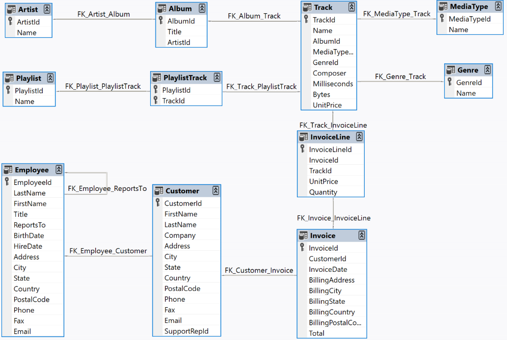

## Solution Architecture   

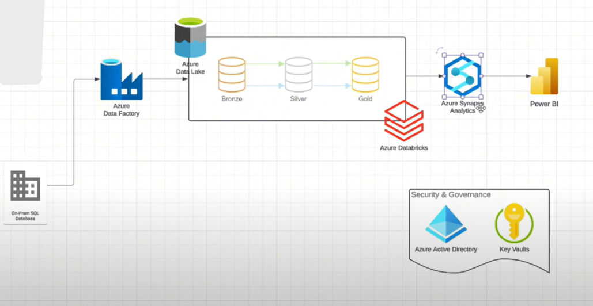

1. **Data Ingestion**  
   - Chinook SQL scripts were executed to create and populate the database in an on-premises SQL Server instance.
   - Azure Data Factory (ADF) pipelines extract raw data into Azure Data Lake Storage (ADLS) - Bronze Layer.

2. **Data Transformation**  
   - Azure Databricks is used to clean, standardize, and enrich the data.
   - Transformed data is written to the Silver and Gold layers in ADLS.

3. **Data Loading & Reporting**  
   - Views are created for each table in the Gold ADLS using Synapse Analytics.
   - Power BI is connected to Synapse to build synamic dashboard.
   - The data model and the entity relationships are established.
   

4. **Automation & Monitoring**  
   - ADF triggers execute pipelines daily.
   - Pipeline status and performance metrics are monitored using ADF and Synapse.

5. **Security & Governance**  
   - Azure Key Vault stores sensitive credentials securely.
   - Role-Based Access Control (RBAC) is enforced using Azure Entra ID.

---

## Services Used and Why

| Azure Service              | Purpose                                                                                   |
|---------------------------|-------------------------------------------------------------------------------------------|
| **SQL Server (On-Premises)** | Source system hosting the Chinook Music Store database. |
| **Azure Data Factory (ADF)** | Orchestrates and automates the ETL process, moving data from SQL Server to Azure Data Lake Storage.    |
| **Azure Data Lake Storage (ADLS)** | Central cloud storage for raw, cleansed, and curated datasets organized into Bronze, Silver, and Gold CONTAINERS. |
| **Azure Databricks**        | Performs data transformation, cleansing, and enrichment using PySpark notebooks. |
| **Azure Synapse Analytics** | Acts as the data warehouse for querying and aggregating Gold layer data efficiently for reporting. Used to create views from the tables to use for reporting      |
| **Power BI**                | Connects to Synapse Analytics and presents data through interactive dashboards and visualizations.       |
| **Azure Key Vault**         | Secures sensitive information such as database credentials, secrets, and keys used across services.     |
| **Azure Entra ID (AAD)**    | Manages identity and access control using Role-Based Access Control (RBAC) to enforce security and governance. |

---

## Setup Instructions

### Prerequisites
- Azure Subscription with adequate credits
- Access to a local machine with SQL Server and SQL Server Management Studio (SSMS)

### Step 1: Azure Environment Setup
1. Create a new Azure Resource Group
2. Provision the following services:
   - Azure Data Factory
   - Azure Data Lake Storage (Bronze, Silver, Gold containers)
   - Azure Databricks Workspace
   - Azure Synapse Analytics Workspace
   - Azure Key Vault
   

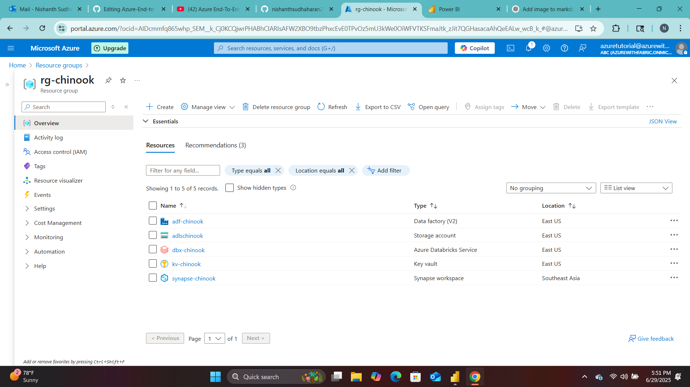

### Step 2: Database Setup
- Execute the Chinook SQL scripts to create and populate the database in SQL Server.

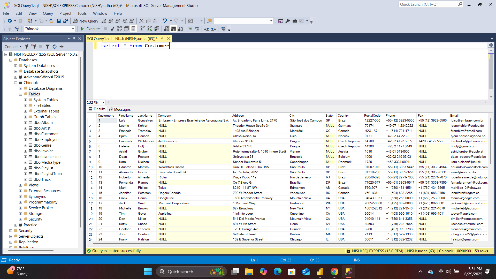

### Step 3: Data Ingestion
- Create linked services and self-hosted integration runtime in ADF
- Store sensitive information as secrets in Key Vault and create a Linked Service pointing to the key vault in ADF
- Build pipelines to copy data from SQL Server to ADLS (Bronze layer)

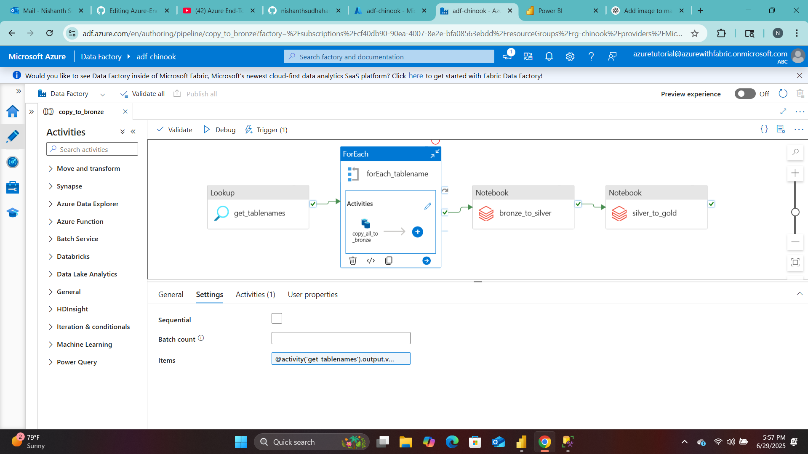
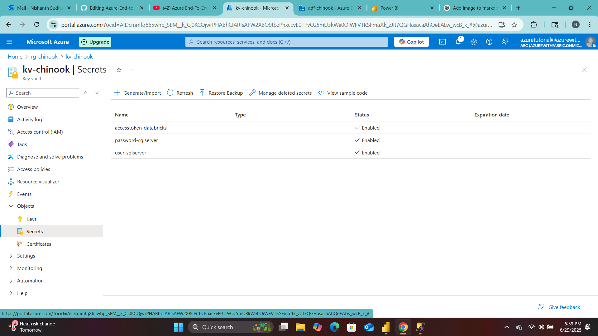

### Step 4: Data Transformation
- Give Storage Blob Data Contributer permission to Unity Catalog Access Connector for databricks

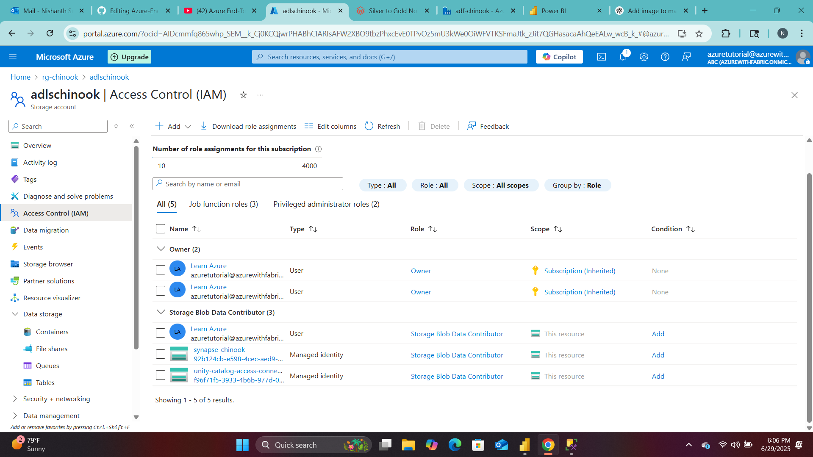   

- Create credentials and external locations pointing to ADLS containers

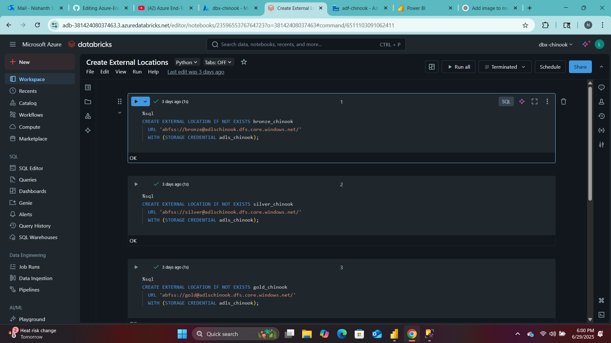   

- Create Databricks notebooks to:
  - Bronze ➝ Silver: Clean and standardize raw data
  - Silver ➝ Gold: Model business-ready data

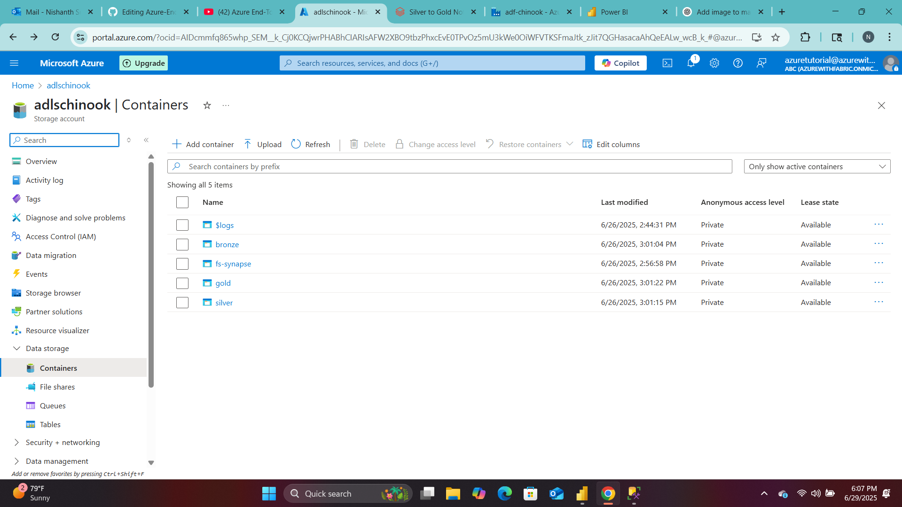
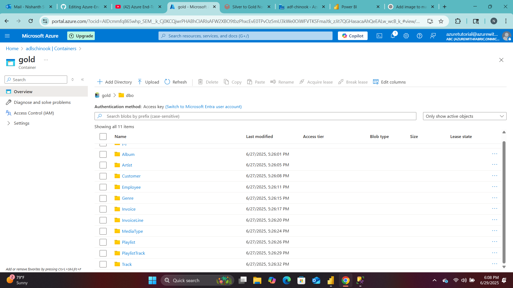

### Step 5: Data Loading & Reporting
- Create a stored procedure that dynamically creates a view for the tables in Gold Layer
- Create a pipeline that gets the metadata (tablenames) and for each tablename execute the stored procedure.

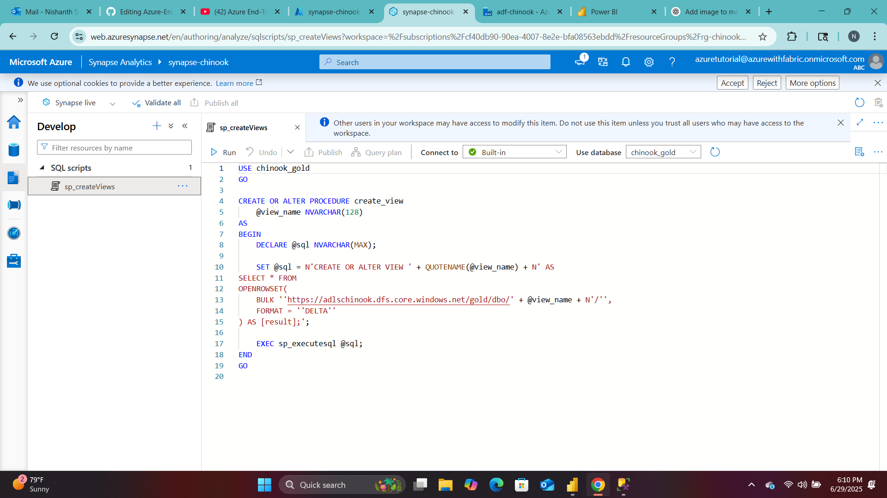
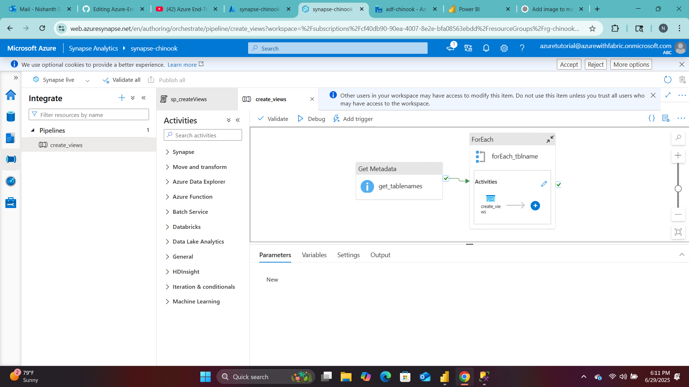
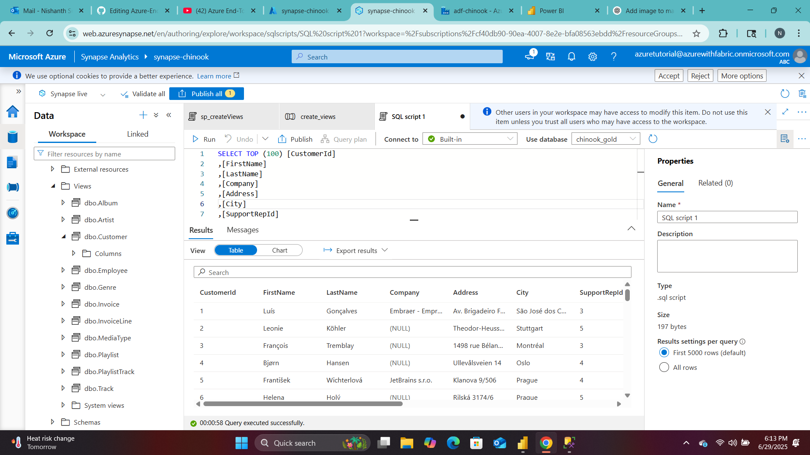   

- Connect Power BI to Synapse
- Design reports and visuals using the Chinook schema and data model

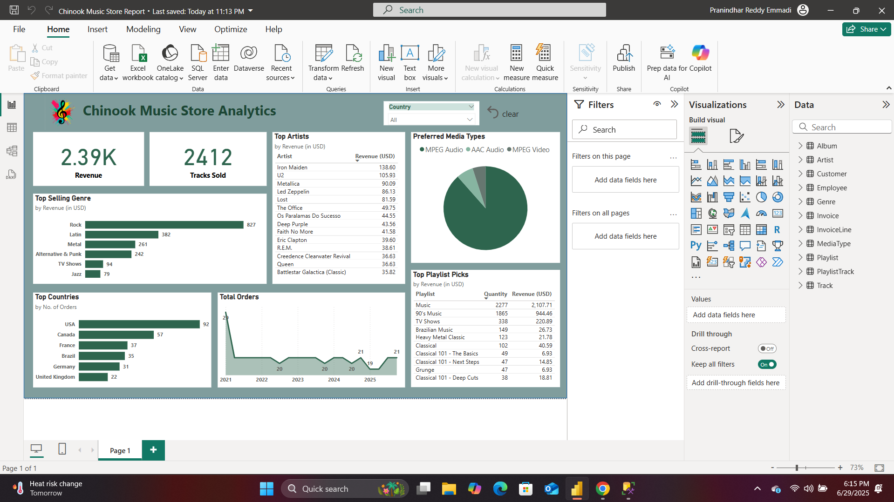
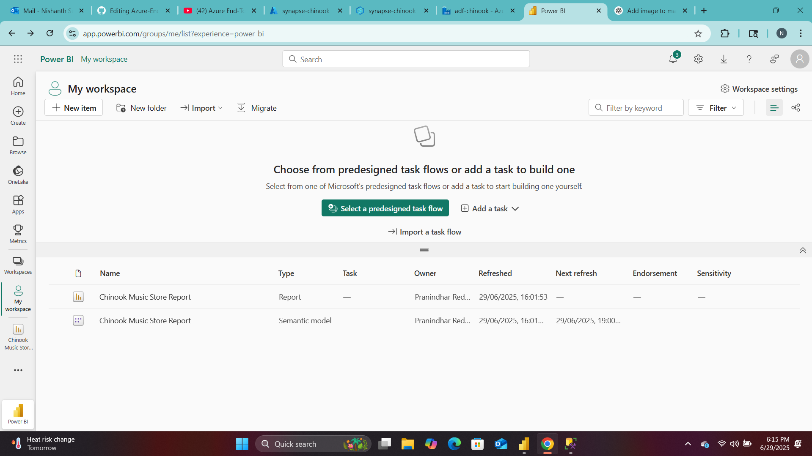   

### Step 6: Automation & Monitoring
- Configure daily triggers in ADF for pipeline execution
- Publish Power BI dashboard and set up refresh schedules

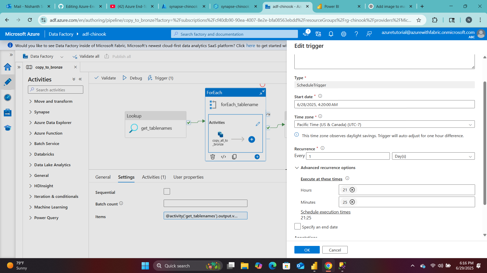
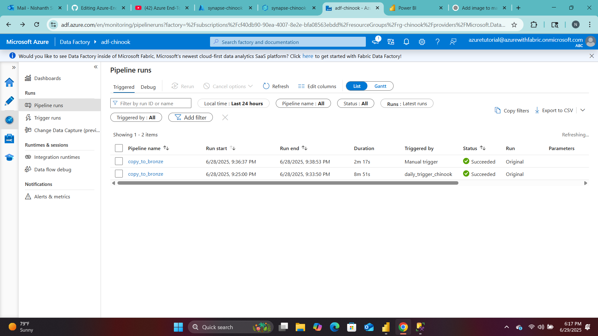 
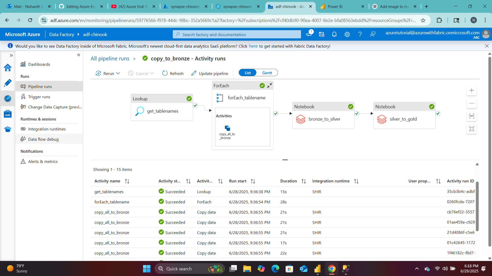   

### Step 7: End-to-End Testing
- Insert test records in SQL Server
- Manually trigger ADF pipeline or wait for the scheduled run
- Verify updates flow from Bronze to Gold
- Confirm updates are reflected in Power BI

---

## Conclusion

This project demonstrates a scalable, secure, and automated data pipeline that converts raw sales data from the Chinook database into meaningful insights through Azure services and Power BI. It helps stakeholders understand product performance by providing an informative dashboard with sales information and analytics. 
